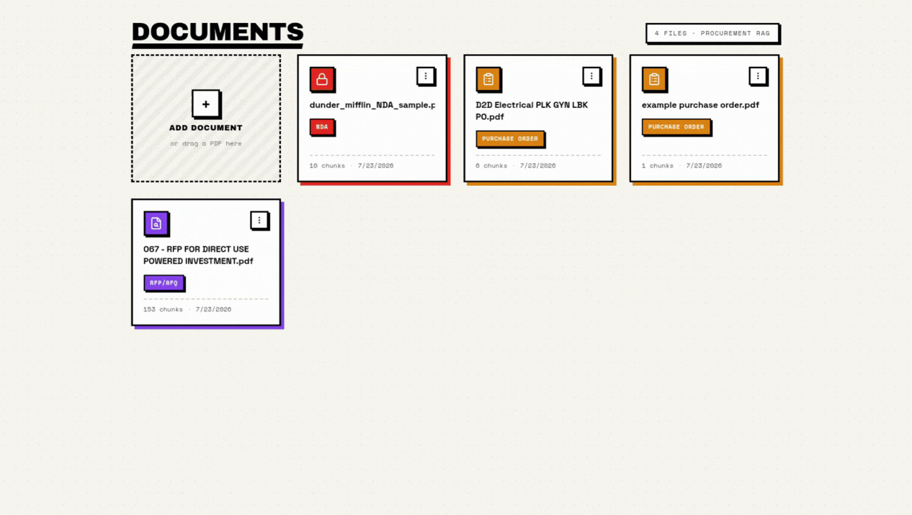

# MONQ Procurement RAG

AI-powered procurement document platform. Upload a PDF → extract & chunk text → embed chunks → classify into a procurement type → chat with the document via grounded RAG.

## Requirements

- Python 3.11+
- Node.js 20+
- Groq API key (free at https://console.groq.com)

## Architecture

For in-depth architectural details, design principles, and data flow specifications, see [docs/architecture.md](docs/architecture.md).

## Testing

For testing strategies, test suite breakdowns, and execution commands, see [docs/testing.md](docs/testing.md).

## API Documentation

For full API documentation, endpoint specifications, and system design overview, see [docs/API.md](docs/API.md).

## Installation

### 1. Clone the Repository

```bash
git clone https://github.com/markbosire/monq-procurement-rag.git
cd monq-procurement-rag
```

### 2. Frontend Setup

First, install dependencies for the frontend application:

```bash
cd frontend
npm install
```

Start the frontend development server:

```bash
npm run dev
```

The frontend server runs on: **http://localhost:5173**

### 3. Backend Setup

`setup.py` creates a virtual environment, installs CPU-only PyTorch (keeps the install small), installs all dependencies, downloads models, and copies `.env.example` to `.env`.

> **GPU note:** This project uses CPU-only PyTorch by default since the embedding model (`all-MiniLM-L6-v2`) runs well on CPU. If you have an NVIDIA GPU and want CUDA acceleration, see the [official PyTorch install guide](https://pytorch.org/get-started/locally/) and install the appropriate CUDA version **before** running `setup.py`.

#### Linux / macOS

```bash
cd backend
python3 setup.py
source .venv/bin/activate
uvicorn app.main:app --host 0.0.0.0 --port 8000
```

#### Windows

```cmd
cd backend
python setup.py
.venv\Scripts\activate
uvicorn app.main:app --host 0.0.0.0 --port 8000
```

Edit `.env` and set your `GROQ_API_KEY`.

The backend API runs on **http://localhost:8000** (Swagger at http://localhost:8000/docs).

## How to Use the System

1. Open your browser and navigate to **http://localhost:5173**.
2. **Upload a PDF**: Drag & drop or select a procurement document (e.g. RFP, Contract, SOW).
3. **View Extraction & Metadata**: See auto-classified procurement category, summaries, and extracted metadata fields.
4. **Chat with Document**: Ask questions about the document and receive grounded AI answers with source highlights.



## AI Usage Disclosure

For details on how AI search agents, prototyping tools, boilerplate generators, testing suites, and documentation tools were utilized, see [docs/AI_USE.md](docs/AI_USE.md).
