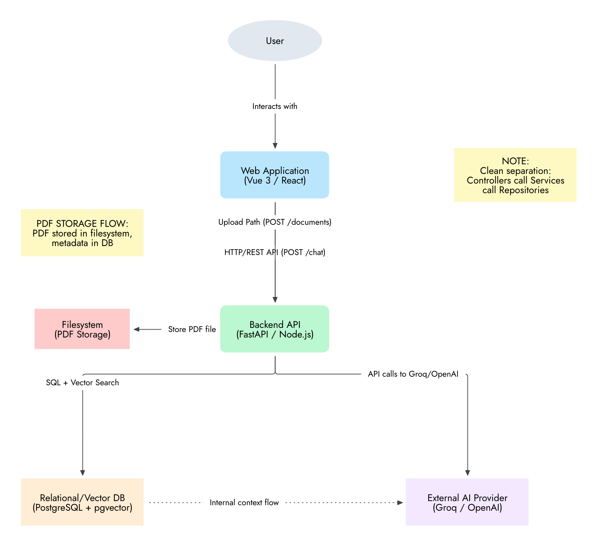
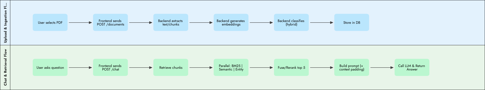
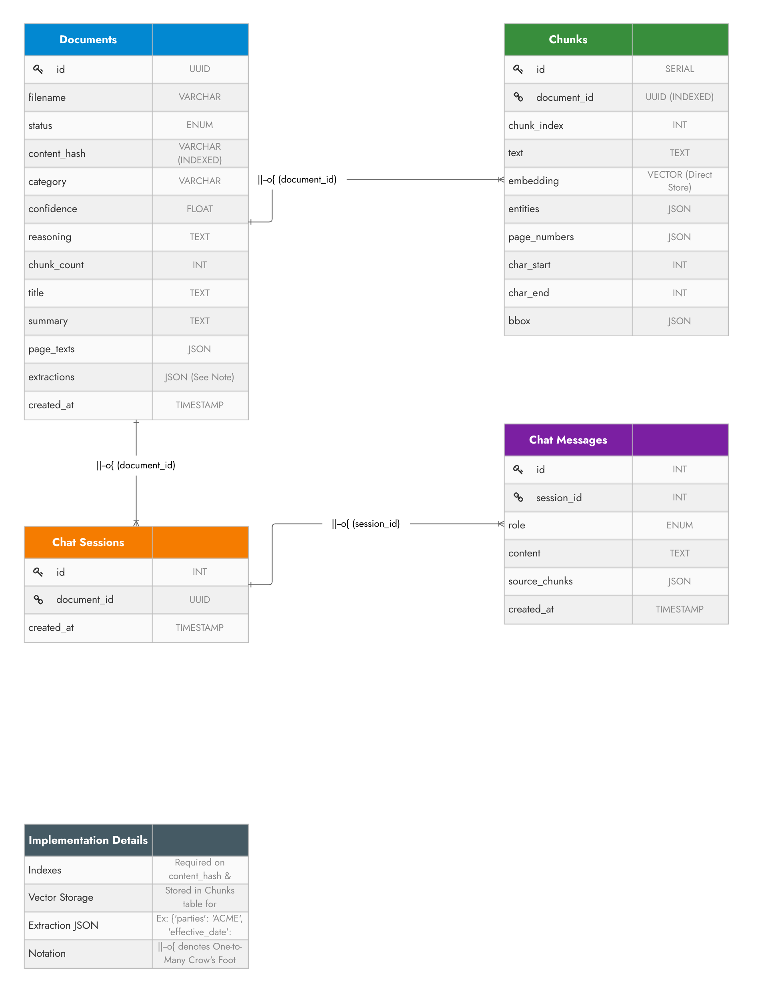
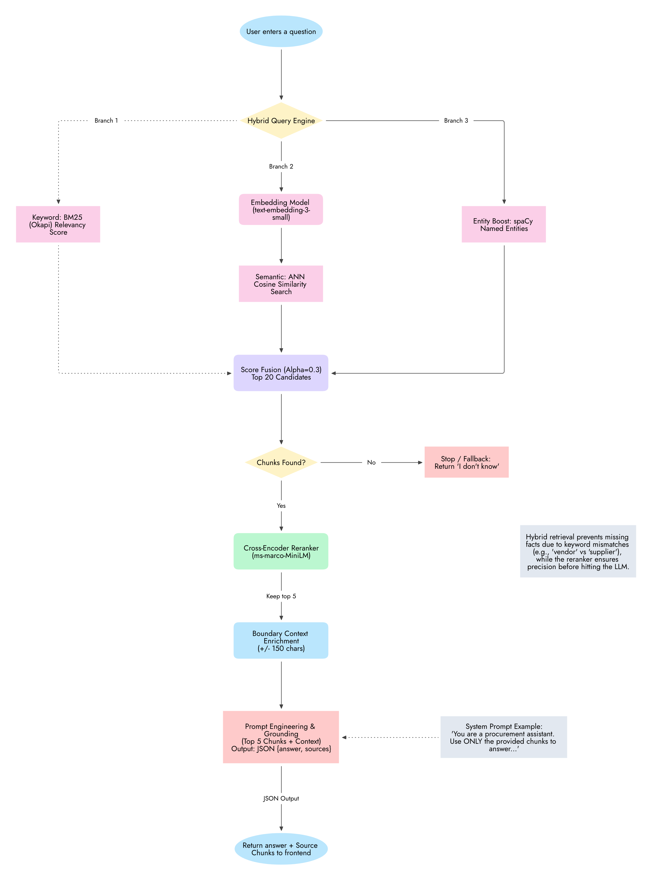

# MONQ Procurement RAG — Architecture & Technical Design

## Table of Contents
1. [System Overview](#1-system-overview)
2. [System Context](#2-system-context)
   - [Core Layers](#core-layers)
   - [Separation of Concerns](#separation-of-concerns)
3. [Data Flow & Processing Pipeline](#3-data-flow--processing-pipeline)
   - [Upload & Ingestion Flow](#upload--ingestion-flow)
   - [Chat & Retrieval Flow](#chat--retrieval-flow)
4. [Data Model](#4-data-model)
   - [Schema Tables & Relationships](#schema-tables--relationships)
   - [Custom Vector Serialization & Indexing](#custom-vector-serialization--indexing)
5. [RAG Pipeline Deep Dive](#5-rag-pipeline-deep-dive)
   - [Chunking & Heading Enrichment](#chunking--heading-enrichment)
   - [Three-Branch Hybrid Retrieval & Fusion](#three-branch-hybrid-retrieval--fusion)
   - [Cross-Encoder Reranking](#cross-encoder-reranking)
   - [Boundary Context Enrichment](#boundary-context-enrichment)
   - [Prompt Engineering & Anti-Hallucination](#prompt-engineering--anti-hallucination)
6. [Technology Stack & Rationale](#6-technology-stack--rationale)
   - [Backend](#backend)
   - [Frontend](#frontend)
   - [Storage & AI Services](#storage--ai-services)
7. [API Design](#7-api-design)
8. [Architecture Decisions & Trade-offs](#8-architecture-decisions--trade-offs)
9. [Testing Strategy](#9-testing-strategy)

---

## 1. System Overview

**MONQ Procurement RAG** is an enterprise-grade AI system designed for processing, understanding, classifying, and querying complex procurement documents—including Requests for Proposals (RFPs), Contracts, Statements of Work (SOWs), Tender Notices, Invoices, and Purchase Orders.

### Core Problem Solved
Procurement documents are long, highly structured, multi-column PDFs filled with legal terms, financial tables, and nested section hierarchies. Generic RAG systems fail on these documents because naive character splitters clip text mid-sentence, strip critical section headers, lose visual context, and allow LLM hallucinations. MONQ Procurement RAG overcomes these challenges with:
- **Header/Footer & Boilerplate Removal**: Filtering out running headers, footers, page numbers, and copyright blocks to clean vector spaces.
- **Heading Context Enrichment**: Prepending structural heading chains (e.g. `[SECTION 1 > A. Delivery]`) to text chunks prior to embedding.
- **Three-Branch Multi-Stage Hybrid Retrieval**: Parallel execution of Okapi BM25 keyword relevancy (Branch 1), dense vector cosine similarity (Branch 2), and spaCy Named Entity Recognition boost (Branch 3).
- **Cross-Encoder Reranking**: Using `ms-marco-MiniLM-L-6-v2` to filter the top 20 candidates down to 5 high-precision chunks.
- **Visual PDF Highlight Syncing**: Mapping extracted text spans to exact PDF page bounding boxes ($x_0, y_0, x_1, y_1$) for interactive in-browser viewer highlighting.

---

## 2. System Context



The system is designed as a decoupled two-tier architecture comprising a modern single-page frontend application and an asynchronous, service-oriented backend API.

### Core Layers

1. **Frontend Layer (Vue 3 + TypeScript + Vite + Pinia)**:
   - Built using Vue 3 Composition API, TypeScript for interface safety, and Pinia for reactive store management (`useDocumentStore`, `useChatStore`).
   - Integrated with PDF.js for client-side rendering and dynamic canvas overlays for active chunk bounding-box highlights.
   - Styled with Tailwind CSS following a modern, responsive design system.

2. **Backend API Layer (FastAPI / Python 3.11+)**:
   - Built on FastAPI for async execution, Pydantic type validation, and automatic OpenAPI schema generation.
   - Manages text extraction, layout reordering, heading parsing, vector embedding generation, hybrid retrieval, and LLM chat orchestration.

3. **Database & Storage Layer (Relational Storage + PDF Filesystem)**:
   - **Database Storage**: Relational SQLite database persisting document metadata, extracted structured fields, per-page text spans, chat message history, and vector embeddings stored directly via custom `VectorType` JSON decorator (supporting SQLite locally or PostgreSQL + `pgvector` in production).
   - **PDF Storage (Filesystem)**: Local directory storage (`./storage/pdfs/`) storing raw uploaded binary PDF documents.

4. **External & Embedded AI Services**:
   - **Sentence-Transformers (`all-MiniLM-L6-v2`)**: Local CPU/GPU sentence embedding model generating 384-dim dense vectors.
   - **Cross-Encoder (`ms-marco-MiniLM-L-6-v2`)**: Local re-ranking model scoring query-document relevance.
   - **spaCy (`en_core_web_sm`)**: Local NLP model providing Named Entity Recognition (NER) for query/chunk entity overlap boosting.
   - **Groq API (`llama-3.3-70b-versatile`)**: Hosted ultra-fast LLM provider used with JSON Mode for structured classification, key-value extraction, and grounded answer generation.

### Separation of Concerns

```
Client Requests ──► FastAPI Routers ──► Service Layer ──► Repository Layer ──► Relational DB / Storage
                    (/api/documents)     (ingestion.py)   (doc_repo.py)       (procurement.db)
                    (/api/chat)          (retrieval.py)   (chat_repo.py)      (storage/pdfs/)
                                         (rag.py)
```

> **Architecture Principle**: Clean separation of concerns — Routers/Controllers call domain Services, which in turn interface with database Repositories.

- **Routers (`app/routers/`)**: Endpoint handlers validating input payloads, managing dependencies, and returning typed response schemas (`documents.py`, `chat.py`).
- **Services (`app/services/`)**: Core domain logic including PDF text extraction (`pdf_extraction.py`), heading detection & chunking (`chunking.py`), embeddings (`embeddings.py`), hybrid retrieval (`retrieval.py`), NER entity extraction (`ner.py`), hybrid classification (`classification.py`), and RAG prompting (`rag.py`).
- **Repositories (`app/repositories/`)**: Encapsulated data-access layer managing SQLAlchemy sessions, queries, and entity persistence (`document_repository.py`, `chat_repository.py`).
- **Models & Session (`app/db/`)**: Database schema definitions and SQLite session factory (`models.py`, `session.py`).

---

## 3. Data Flow & Processing Pipeline



### Upload & Ingestion Flow

1. **Client Selection & Upload**: The user selects a PDF file in the Vue 3 interface, triggering `POST /api/documents`.
2. **File Storage & Deduplication**: The backend computes SHA-256 content hashes (`content_hash`), validates PDF magic bytes, and saves the binary file to `./storage/pdfs/{document_id}.pdf`.
3. **Text & Bbox Extraction**:
   - `PyMuPDF` (`fitz`) parses text blocks and line spans ($x_0, y_0, x_1, y_1$).
   - Layout analysis detects multi-column pages and reorders line spans by column position.
   - Heuristics remove running headers, footers, page numbers (e.g. `Page 1 of 12`), and blank page boilerplate.
4. **Heading Detection & Chunking**:
   - Scans line text for structural patterns: ALL-CAPS titles, `SECTION`/`ARTICLE` markers, and numbered/lettered headings.
   - `RecursiveCharacterTextSplitter` divides page text (`chunk_size=1000`, `overlap=150`).
   - Each chunk is enriched by prepending its active heading chain (e.g., `[SECTION 1 > A. Scope]`).
5. **Vector Embedding & NER**:
   - `all-MiniLM-L6-v2` encodes all chunks in a single batched pass into 384-dim dense vectors.
   - `spaCy` extracts named entities (`ORG`, `DATE`, `MONEY`, `GPE`, `LAW`) from each chunk and stores entity lists in SQLite.
6. **Hybrid Classification & Extractions**:
   - Document centroid vector is compared against pre-computed category exemplar embeddings via cosine similarity.
   - Key representative chunks (medoid + keyword-matched) are passed to Groq LLaMA 3.3 70B in JSON mode to confirm category, summary, confidence, and structured field extractions (e.g., `parties`, `effective_date`, `contract_value`) with chunk-index references.
7. **Persistence**: The document metadata, extractions, chunks, bounding-box spans, and vector embeddings are stored in the relational database.

### Chat & Retrieval Flow

1. **User Submits Question**: Client posts `{"question": "..."}` to `POST /api/documents/{id}/chat`.
2. **Chunk Retrieval**: Loads document chunks, text, entity metadata, and vector embeddings from the database.
3. **Three-Branch Parallel Relevancy Scoring**:
   - **Branch 1 (Keyword BM25)**: Okapi BM25 scores term relevancy to prevent missing facts due to keyword mismatches (e.g., 'vendor' vs 'supplier').
   - **Branch 2 (Semantic Embedding)**: Dense vector cosine similarity search via `all-MiniLM-L6-v2`.
   - **Branch 3 (Entity Boost)**: spaCy extracts entities from the user query; chunks sharing identical entity types receive a $+0.15$ boost per match.
4. **Score Fusion**:
   $$\text{FusedScore} = 0.3 \times \text{BM25}_{\text{norm}} + 0.7 \times \text{Semantic}_{\text{norm}} + \text{EntityBoost}$$
   Selects the top 20 candidates.
5. **Cross-Encoder Reranking**: The top 20 candidate chunks are scored by `ms-marco-MiniLM-L-6-v2` cross-encoder to yield the top 5 most relevant context chunks. If no chunks pass relevancy checks, the system returns a fallback *"I cannot answer based on the provided document."*
6. **Boundary Context Padding**: Chunks are expanded by $\pm 150$ characters from adjacent document text to eliminate mid-sentence clipping.
7. **Grounded LLM Completion**:
   - Messages built with system prompt, known extracted fields, document metadata, and context chunks tagged as `[Chunk 1]`, `[Chunk 2]`.
   - Sent to Groq LLaMA 3.3 70B with `response_format={"type": "json_object"}`.
8. **Client Response**: Returns JSON response containing `answer` text, cited `source_chunks`, and associated page bounding-box coordinates for live viewer highlight rendering.

---

## 4. Data Model



### Schema Tables & Relationships

The relational data model consists of four core tables connected via One-to-Many (`||--o{`) relationships:

```
[Documents] 1 ────< N [Chunks]
     │
     1
     │
     └───< N [Chat Sessions] 1 ────< N [Chat Messages]
```

#### `Documents` Table
Represents uploaded procurement files, processing state, classification, and key-value field extractions.

| Column Name | Data Type | Key / Constraint | Description |
|---|---|---|---|
| `id` | `UUID` / `VARCHAR(36)` | Primary Key | Unique document identifier |
| `filename` | `VARCHAR(255)` | Not Null | Original uploaded filename |
| `status` | `ENUM` / `VARCHAR(50)` | Not Null, Default `processing` | Ingestion status (`processing`, `ready`, `failed`) |
| `content_hash` | `VARCHAR(64)` | Indexed | SHA-256 hash for deduplication |
| `category` | `VARCHAR(100)` | Nullable | Classified procurement category |
| `confidence` | `FLOAT` | Nullable | Classification confidence score (0.0–1.0) |
| `reasoning` | `TEXT` | Nullable | LLM classification explanation |
| `chunk_count` | `INT` | Default `0` | Total generated chunks |
| `title` | `TEXT` | Nullable | Extracted document title |
| `summary` | `TEXT` | Nullable | Auto-generated document summary |
| `page_texts` | `JSON` | Nullable | Array of per-page extracted text strings |
| `extractions` | `JSON` | Nullable | Structured JSON extractions (e.g. `parties`, `effective_date`) with bboxes |
| `created_at` | `TIMESTAMP` | Server Default `NOW()` | Creation timestamp |

#### `Chunks` Table
Stores individual text chunks, embeddings, entity annotations, and PDF bounding boxes.

| Column Name | Data Type | Key / Constraint | Description |
|---|---|---|---|
| `id` | `SERIAL` / `INT` | Primary Key | Auto-increment chunk ID |
| `document_id` | `UUID` | Foreign Key (Indexed) | References `Documents(id)` ON DELETE CASCADE |
| `chunk_index` | `INT` | Not Null | Sequential chunk position index |
| `text` | `TEXT` | Not Null | Chunk text with prepended heading breadcrumbs |
| `embedding` | `VECTOR` / `TEXT` | Direct Store | 384-dim vector stored as JSON array string |
| `entities` | `JSON` | Nullable | List of spaCy extracted entity dicts `{text, label}` |
| `page_numbers` | `JSON` | Nullable | List of page numbers spanned by chunk |
| `char_start` | `INT` | Nullable | Character start offset in document text |
| `char_end` | `INT` | Nullable | Character end offset in document text |
| `bbox` | `JSON` | Nullable | List of bounding boxes `[{page, x0, y0, x1, y1}]` |

#### `Chat Sessions` Table
Represents document-scoped chat conversations.

| Column Name | Data Type | Key / Constraint | Description |
|---|---|---|---|
| `id` | `INT` | Primary Key | Auto-increment session ID |
| `document_id` | `UUID` | Foreign Key | References `Documents(id)` ON DELETE CASCADE |
| `created_at` | `TIMESTAMP` | Server Default `NOW()` | Session start timestamp |

#### `Chat Messages` Table
Stores individual chat turns and cited source chunk references.

| Column Name | Data Type | Key / Constraint | Description |
|---|---|---|---|
| `id` | `INT` | Primary Key | Auto-increment message ID |
| `session_id` | `INT` | Foreign Key | References `ChatSessions(id)` ON DELETE CASCADE |
| `role` | `ENUM` / `VARCHAR(50)` | Not Null | Message role (`user`, `assistant`) |
| `content` | `TEXT` | Not Null | Message text content |
| `source_chunks` | `JSON` | Nullable | List of cited chunk IDs and bounding-box coordinates |
| `created_at` | `TIMESTAMP` | Server Default `NOW()` | Message creation timestamp |

### Custom Vector Serialization & Indexing

- **Indexing**: Required database B-tree indexes are maintained on `documents.content_hash` for fast deduplication and `chunks.document_id` for fast document-scoped chunk retrieval.
- **Vector Storage**: Vector embeddings are directly stored inside the `Chunks` table (`embedding` column) using SQLAlchemy `VectorType` JSON serialization, maintaining zero external vector database dependencies while ensuring full forward-compatibility with `pgvector`.
- **Extraction JSON Structure**: Key-value extractions follow a normalized JSON structure:
  ```json
  {
    "parties": {"value": "ACME Corp & MONQ Ltd", "chunk_index": 0, "page_numbers": [1], "bbox": [...]},
    "effective_date": {"value": "2026-01-01", "chunk_index": 1, "page_numbers": [1], "bbox": [...]}
  }
  ```

---

## 5. RAG Pipeline Deep Dive



### Chunking & Heading Enrichment
- **Parameters**: `chunk_size = 1000` characters, `chunk_overlap = 150` characters.
- **Why these parameters**: Balance semantic independence with chunk boundary continuity.
- **Heading Detection Engine**: Scans text lines using regular expressions for structural markers:
  - `L0`: ALL-CAPS lines ($\ge 70\%$ uppercase, $\ge 5$ characters).
  - `L1`: Key section keywords (`SECTION`, `ARTICLE`, `PART`, `EXHIBIT`).
  - `L2`: Lettered section headers (e.g. `A. GENERAL PROVISIONS`).
  - `L3`: Numbered subsection headers (e.g. `1. Definitions`).
- **Heading Context Prepending**: Every chunk text is prepended with its active section breadcrumb before embedding:
  ```text
  [SECTION 2. ELIGIBILITY > B. Technical Criteria] The bidder must possess ISO 9001 certification...
  ```

### Three-Branch Hybrid Retrieval & Fusion
When a user asks a question, the `Hybrid Query Engine` executes three parallel retrieval branches:

```
                          User Question
                               │
                      Hybrid Query Engine
             ┌──────────────────┼──────────────────┐
             ▼                  ▼                  ▼
        [Branch 1]         [Branch 2]         [Branch 3]
       BM25 Keyword      Dense Vector ANN     spaCy NER
       (Okapi Score)     Cosine Similarity   Entity Boost
             │                  │                  │
             └──────────────────┼──────────────────┘
                                ▼
                     Score Fusion (Alpha=0.3)
                       (Top 20 Candidates)
```

1. **Branch 1 (Keyword BM25)**: Computes term frequency & inverse document frequency using Okapi BM25 algorithm. Prevents missing facts due to keyword mismatches (e.g., 'vendor' vs 'supplier').
2. **Branch 2 (Semantic ANN Cosine Similarity)**: Dense 384-dim vector similarity search via `all-MiniLM-L6-v2`.
3. **Branch 3 (Entity Boost)**: spaCy identifies named entities (`ORG`, `DATE`, `MONEY`). Chunks matching query entity types receive a $+0.15$ boost.
4. **Min-Max Score Normalization & Fusion**:
   $$\text{FusedScore} = 0.3 \times \text{BM25}_{\text{norm}} + 0.7 \times \text{Sem}_{\text{norm}} + \text{EntityBoost}$$

### Cross-Encoder Reranking
- **Model**: `cross-encoder/ms-marco-MiniLM-L-6-v2`.
- **Mechanism**: The top 20 candidate chunks from Stage 1 are passed to the cross-encoder. Joint self-attention over `(query, chunk_text)` pairs evaluates deep contextual relevance, selecting the top 5 chunks.
- **Fallback**: If no chunks are found or relevancy criteria fail, execution stops and returns *"I cannot answer based on the provided document."*

### Boundary Context Enrichment
Retrieved top 5 chunks are padded with $\pm 150$ characters from neighboring chunks to prevent truncated sentence boundaries from obscuring legal meaning before sending to the LLM.

### Prompt Engineering & Anti-Hallucination
- **Grounding Rules**: System prompt explicitly instructs:
  > *"You are a procurement assistant. Answer the user's question based solely on the provided document context below. Use ONLY the provided chunks to answer..."*
- **JSON Output Format**: Requires strict JSON output: `{"answer": "...", "sources": [1, 3]}`.

---

## 6. Technology Stack & Rationale

### Backend
- **FastAPI**: Asynchronous Python web framework providing high throughput, native OpenAPI docs, and Pydantic validation.
- **SQLAlchemy**: Enterprise ORM handling database sessions, relationships, and migration schemas.
- **PyMuPDF (`fitz`)**: Fast PDF parsing library capable of extracting line-level text and pixel coordinates ($x_0, y_0, x_1, y_1$).
- **LangChain (`text_splitters`)**: `RecursiveCharacterTextSplitter` for paragraph-aware character splitting.
- **Sentence-Transformers (`all-MiniLM-L6-v2`)**: Compact 384-dimensional embedding model providing fast local execution without external API dependencies.
- **Cross-Encoder (`ms-marco-MiniLM-L-6-v2`)**: Specialized re-ranking model maximizing retrieval precision.
- **spaCy (`en_core_web_sm`)**: Fast local NLP library for entity extraction and retrieval boosting.
- **Groq SDK (`llama-3.3-70b-versatile`)**: Ultra-fast cloud LLM inference platform with native JSON mode support.

### Frontend
- **Vue 3**: Reactive UI framework using Composition API and TypeScript.
- **Pinia**: Centralized state management for managing document lists, viewer settings, and chat history.
- **Vite**: Modern frontend build tool supporting instant HMR and optimized production builds.
- **PDF.js**: Mozilla's JavaScript PDF viewer engine enabling canvas-rendered PDF display with highlight layers.
- **Tailwind CSS**: Utility-first CSS framework for flexible styling.

### Storage & AI Services
- **SQLite / PostgreSQL**: Self-contained relational database requiring no external database server administration for local setup, with seamless upgrade path to PostgreSQL + `pgvector`.
- **JSON Vector Storage**: Stores floating-point embeddings inside database columns, simplifying setup while preserving full vector math capabilities.

---

## 7. API Design

For comprehensive endpoint payload definitions, request/response schemas, and example curl calls, see [API.md](./API.md).

| Method | Endpoint | Description | Request Body | Response |
|---|---|---|---|---|
| `GET` | `/api/documents` | List all processed documents | None | `List[DocumentResponse]` |
| `POST` | `/api/documents` | Upload PDF file | `multipart/form-data` (`file`) | `DocumentUploadResponse` |
| `GET` | `/api/documents/{id}` | Get document metadata & extractions | None | `DocumentDetailResponse` |
| `PATCH` | `/api/documents/{id}` | Rename document title | `{"title": "..."}` | `DocumentDetailResponse` |
| `DELETE` | `/api/documents/{id}` | Delete document & file | None | `{"status": "deleted"}` |
| `GET` | `/api/documents/{id}/pdf` | Stream binary PDF content | None | Binary PDF Stream |
| `GET` | `/api/documents/{id}/pages` | Get per-page text & bounding boxes | None | `PageTextsResponse` |
| `GET` | `/api/documents/{id}/chat/history` | Get chat history for document | None | `ChatHistoryResponse` |
| `POST` | `/api/documents/{id}/chat` | Submit question to RAG pipeline | `{"question": "..."}` | `ChatQueryResponse` |

---

## 8. Architecture Decisions & Trade-offs

| Decision | Selection Rationale | Trade-off / Mitigation |
|---|---|---|
| **SQLite with custom VectorType** | Zero external installation steps; runs anywhere out of the box. | In-memory cosine distance is $O(N)$ per query. Mitigated because vector search is document-scoped ($N < 1000$ chunks per doc). |
| **Vectors in JSON TEXT columns** | Avoids C-extensions or external vector database complexity. | Slightly larger storage footprint; deserialized into Python lists at query time. |
| **Three-Branch Hybrid Retrieval (BM25 + Semantic + NER)** | Ensures exact keyword matching for IDs/amounts while preserving semantic understanding. | Requires building BM25 indices and running spaCy NER at ingestion time. |
| **Cross-Encoder Reranking** | Filters out false-positive chunks from initial vector search. | Adds ~50–100ms inference time per query (acceptable trade-off for higher accuracy). |
| **Heading Context Prepending** | Preserves section context without modifying DB schemas. | Increases token lengths per chunk slightly. |
| **Boundary Context Padding ($\pm 150$ chars)** | Prevents mid-sentence truncation in context chunks. | Minor increase in LLM prompt token size. |
| **Local File PDF Storage** | Simple, fast file streaming without S3 setup. | Deleting documents requires removing local files asynchronously. |

---

## 9. Testing Strategy

### Backend Testing (`pytest`)
- **Unit Tests**: Test chunking rules (`test_chunking.py`), classification selection (`test_classification.py`), and utility functions.
- **Endpoint Tests**: Test FastAPI routers (`test_documents_endpoint.py`, `test_chat_endpoint.py`) using in-memory SQLite and mocked LLM responses.
- **Integration Tests**: Marked with `@pytest.mark.integration` to test end-to-end embedding generation and live Groq LLM API responses.
- **Target Coverage**: $>80\%$ statement and line coverage.

### Frontend Testing (`Vitest` + Vue Test Utils)
- **Unit Tests**: Test Pinia stores (`useDocumentStore`, `useChatStore`), composables (`useToast`, `useSourceViewer`), and UI components (`PdfCanvas`, `DocumentViewerPanel`, `MetadataPanel`).
- **Integration Tests**: Verify full component workflows (`UploadNavigateChat.test.ts`, `SourceHighlightPdfSync.test.ts`).
- **Target Coverage**: $>75\%$ statements and lines enforced in `vite.config.ts`.
